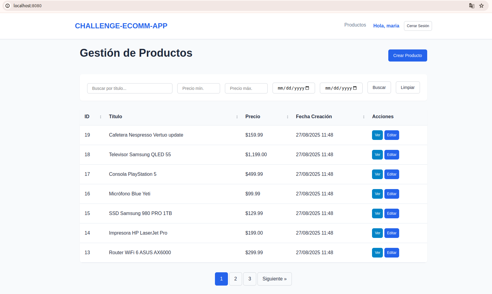
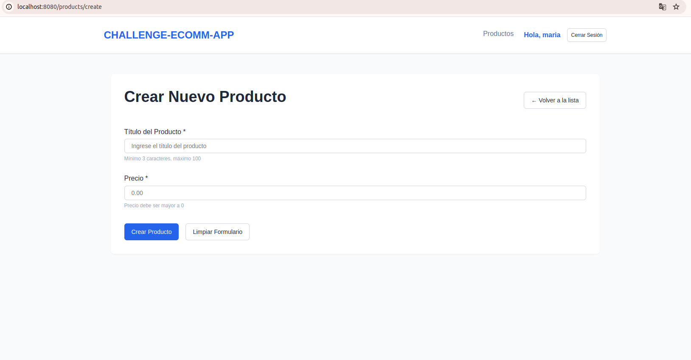
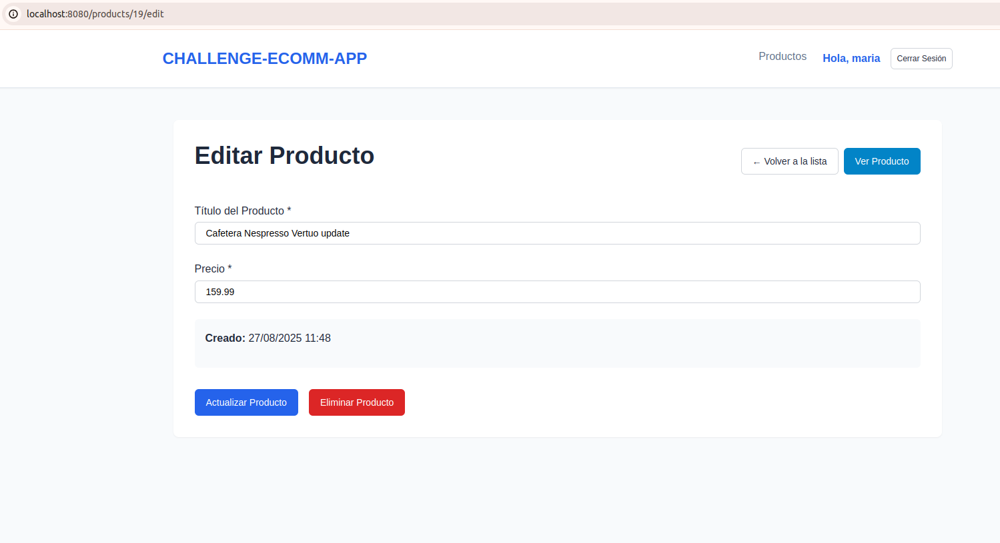
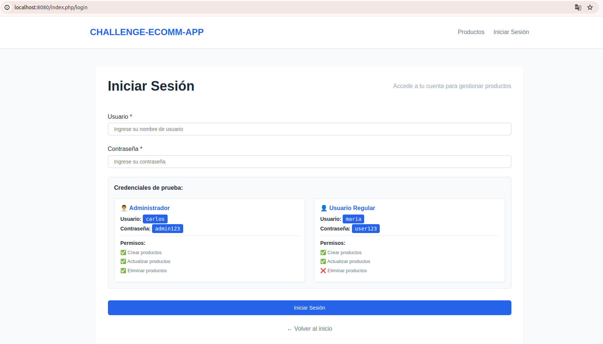

# ECOMM-APP Challenge Técnico

## Descripción del Challenge

Este proyecto implementa un **sistema CRUD básico para gestión de productos** desarrollado como respuesta a un challenge técnico. La aplicación permite crear, leer, actualizar y eliminar productos utilizando el patrón MVC, sin conexión a base de datos, empleando almacenamiento en archivo JSON.

### Objetivos del Challenge
- Implementar CRUD básico de una entidad "Producto"
- Utilizar patrón MVC con framework PHP (CodeIgniter 4)
- Almacenamiento en archivo JSON local (sin base de datos)
- Frontend interactivo con JavaScript vanilla
- Validaciones server-side y client-side
- Sistema de autenticación básico
- Operaciones asíncronas con AJAX
- Búsqueda, filtrado y paginación
- Manejo de errores y logging
- Pruebas unitarias
- Seguridad (CSRF, validación de datos)

## Arquitectura y Stack Tecnológico

### Backend
- **Framework**: CodeIgniter 4
- **Lenguaje**: PHP 8.2
- **Almacenamiento**: Archivo JSON (`productos.json`)
- **Testing**: PHPUnit

### Frontend
- **HTML5** semántico y responsive
- **CSS3** con sistema de variables y componentes
- **JavaScript Vanilla** (sin librerías externas)
- **AJAX** para todas las operaciones CRUD

### Estructura del Proyecto
```
basic-crud-project/
├── app/
│   ├── Controllers/
│   │   ├── ProductController.php    # CRUD de productos
│   │   └── LoginController.php      # Autenticación
│   ├── Models/
│   │   └── ProductModel.php         # Lógica de negocio
│   ├── Entities/
│   │   └── Product.php              # Entidad con validaciones
│   ├── Views/
│   │   ├── products/                # Vistas de productos
│   │   ├── auth/                    # Vista de login
│   │   └── layouts/                 # Layout principal
│   ├── Libraries/
│   │   └── JSONStorage.php          # Manejo de persistencia JSON
│   └── Traits/
│       ├── CrudLoggingTrait.php     # Logging estructurado
│       └── ErrorHandlingTrait.php   # Manejo de errores
├── public/
│   └── assets/
│       ├── css/main.css             # Estilos del sistema
│       └── js/                      # Codigo JavaScript
└── tests/
    └── unit/                        # Pruebas unitarias
```

## Características Implementadas

### CRUD Completo
- **Crear productos** con validación completa
- **Listar productos** con tabla interactiva
- **Editar productos** con formularios pre-llenados
- **Eliminar productos** con confirmación
- **Ver detalles** de productos individuales

### Búsqueda y Filtrado Avanzado
- Búsqueda por título de producto
- Filtro por rango de precios (mín/máx)
- Filtro por rango de fechas
- Ordenamiento por columnas (título, precio, fecha)
- Paginación configurable
- **Todas las operaciones vía AJAX** (sin recargar página)

### Seguridad y Autenticación
- Sistema de login básico con roles (admin/user)
- Protección CSRF en todos los formularios
- Validación y escape de datos de entrada
- Control de acceso por roles:
  - **Admin**: Puede crear, editar y eliminar productos
  - **User**: Puede crear y editar, pero NO eliminar

### Validaciones y Manejo de Errores
- **Validaciones server-side** con reglas de negocio
- **Validaciones client-side** en tiempo real
- **Manejo centralizado de errores** con clases de excepción personalizadas
- **Logging estructurado** de todas las operaciones CRUD
- Mensajes de error user-friendly

### Testing y Calidad de Código
- **Pruebas unitarias** para componentes clave:
  - JSONStorage (persistencia)
  - Product Entity (validaciones y reglas de negocio)
  - ProductModel (Manejo de datos / operaciones CRUD)
- **Principios SOLID** aplicados
- **Patrón MVC** correctamente implementado
- **Traits reutilizables** para funcionalidades comunes

## Capturas de Pantalla

### Vista Principal - Lista de Productos


### Formulario de Creación


### Formulario de Edición


### Sistema de Login


## Configuración y Ejecución

### Prerrequisitos
- Docker Desktop
- VS Code con extensión "Dev Containers"
- Git

### Instalación

1. **Clonar el repositorio:**
   ```bash
   git clone https://github.com/jesusdpp96/ecomm-app-challenge.git
   cd challege-ecomm-app
   ```

2. **Abrir en VS Code:**
   ```bash
   code .
   ```

3. **Reabrir en contenedor:**
   - VS Code mostrará un prompt para "Reopen in Container"
   - O usar Ctrl+Shift+P → "Dev Containers: Reopen in Container"

4. **Ejecutar el servidor:**
   ```bash
   cd basic-crud-project
   php spark serve --host=0.0.0.0 --port=8080
   ```

5. **Acceder a la aplicación:**
   - Abrir navegador en `http://localhost:8080`

### Credenciales de Prueba
- **Admin**: `admin` / `admin123` (puede crear, editar y eliminar)
- **User**: `user` / `user123` (puede crear y editar, NO eliminar)

## Ejecutar Pruebas

```bash
# Todas las pruebas
./vendor/bin/phpunit ./tests/unit/Models/ProductModelTest.php
./vendor/bin/phpunit ./tests/unit/Entities/ProductTest.php
./vendor/bin/phpunit ./tests/unit/Libraries/JSONStorageTest.php
```

## Documentación Complementaria

### Documentos Técnicos
- **[Instrucciones del Challenge](docs/instructions.md)** - Requisitos originales
- **[Documento de Diseño](docs/design-document.md)** - Arquitectura y especificaciones técnicas
- **[Instrucciones con Comentarios](docs/instructions-with-comments.md)** - Estado de implementación detallado

### Guías de Configuración
- **[Entorno de Desarrollo](docs/codeigniter-develop-enviroment.md)** - Setup con Docker y VS Code
- **[Ejecutar Servidor](docs/run-server.md)** - Comandos para iniciar la aplicación
- **[Ejecutar Pruebas](docs/run-tests.md)** - Comandos para testing

## Características Destacadas de la Implementación

### 1. **Arquitectura Limpia**
- Separación clara de responsabilidades (MVC)
- Traits reutilizables para funcionalidades transversales
- Clases de excepción personalizadas
- Manejo centralizado de errores y logging

### 2. **Experiencia de Usuario**
- **Operaciones 100% asíncronas** - Sin recargas de página
- **Validación en tiempo real** - Feedback inmediato
- **Estados de carga** - Indicadores visuales durante operaciones
- **Notificaciones toast** - Feedback claro de éxito/error
- **Diseño responsive** - Funciona en móviles y desktop

### 3. **Seguridad Robusta**
- Protección CSRF en todas las operaciones
- Validación exhaustiva de datos de entrada
- Control de acceso basado en roles
- Escape de datos para prevenir XSS
- Logging de operaciones para auditoría

### 4. **Persistencia Confiable**
- Validación de integridad de datos JSON
- Manejo de concurrencia con locks de archivo

### 5. **Código Mantenible**
- Principios SOLID aplicados consistentemente
- Pruebas unitarias para componentes críticos
- Configuración centralizada y versionado

## Cumplimiento de Requisitos

| Requisito | Estado | Implementación |
|-----------|--------|----------------|
| Framework PHP (CodeIgniter) | ✅ | CodeIgniter 4 con PHP 8.2 |
| Patrón MVC | ✅ | Controllers, Models, Views separados |
| Entidad Producto | ✅ | Entity con validaciones completas |
| Almacenamiento JSON | ✅ | JSONStorage con backup y recovery |
| Frontend JavaScript | ✅ | Vanilla JS con clases modulares |
| Validación de Datos | ✅ | Server-side y client-side |
| Manejo de Errores | ✅ | Clases de excepción personalizadas |
| Paginación y Búsqueda | ✅ | Filtros avanzados con AJAX |
| Seguridad (CSRF) | ✅ | Tokens en formularios y AJAX |
| Logging | ✅ | CrudLoggingTrait estructurado |
| Pruebas Unitarias | ✅ | PHPUnit para componentes clave |
| Operaciones Asíncronas | ✅ | 100% AJAX, sin recargas |
| Control de Acceso | ✅ | Sistema de roles admin/user |
